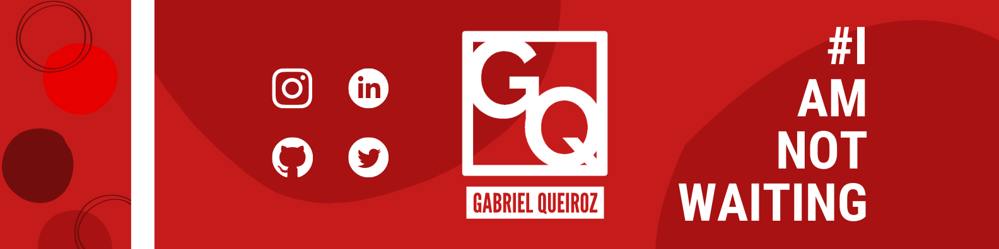

    
    
    
# Hi there 👋, my name is Gabriel!
    
### 🌎 I am a Frontend Web Developer right from Brazil! 😉
    

   
## ✔️ Skills and Experience ✔️

* 💻 HTML, CSS, JS
* ⚛ React
* 📱 React Native
* 🧠 UI / UX
* 🎮 Unreal Engine
    

## 📚 Bio 📚

- 🔭 I’m currently working on InsulHub 
- 🌱 I’m currently learning SQL (And realizing I hate it) & Typescript
- 🤔 I’m looking forward to learning Backend and Cybersec (a.k.a HACKIN'!) 
- 📫 How to reach me: gabrielr.queiroz@gmail.com 
- ⚡ Fun fact: I think that I am funny :)
  
##

 

## Want to talk about something? 📝

          

# 👇 CHECK MY REPOS OUT 👇
    

